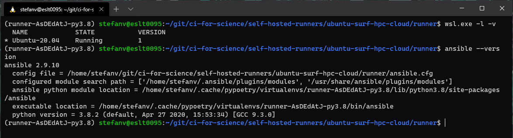
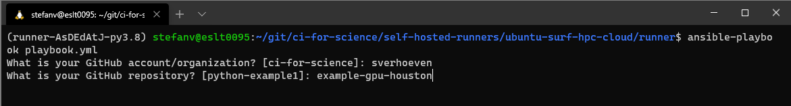
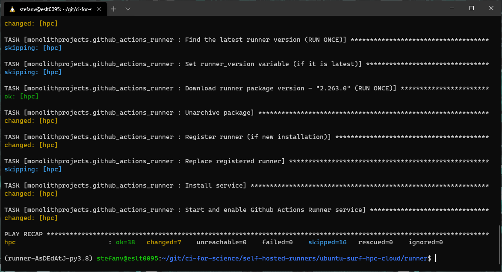
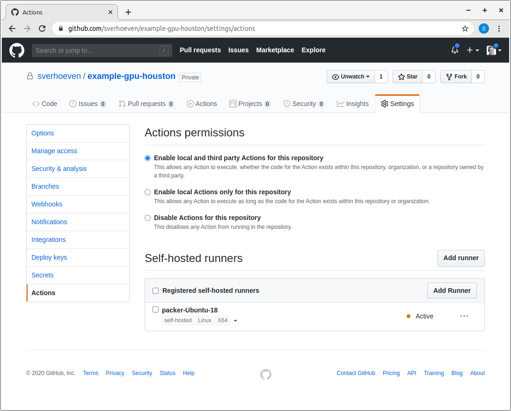

# Setup GitHub Action runner on a VM on SURF HPC Cloud from Windows

Most of the steps in [/ubuntu-surf-hpc-cloud/README.md](/ubuntu-surf-hpc-cloud/README.md) can be reused except for installing Ansible.

Ansible can not be initiated from Windows powershell or command prompt.
You will need to install Ansible in [Windows Subsystem for Linux (WSL)](https://docs.microsoft.com/en-us/windows/wsl/) using any of the [WSL OS choices](https://docs.microsoft.com/en-us/windows/wsl/install-win10#install-your-linux-distribution-of-choice) that [Ansible supports](https://docs.ansible.com/ansible/latest/installation_guide/intro_installation.html) like Ubuntu 20.04.


## Example run-through

[I](https://github.com/sverhoeven) used the [https://github.com/ci-for-science/example-gpu-houston](https://github.com/ci-for-science/example-gpu-houston) repo and am already started VM in the SURF HPC cloud to run a self hosted GitHub action runner. Through out this run-through I will use my account `sverhoeven` and `example-gpu-houston` as repo name, please replace with your account/repo for your own run-through. Below are screenshots of the run-through.

I was using Ubuntu 20.04 on WSL1 with Python 3.8.2 and Ansible v2.9.10.



> At the time the `sleep` command did not work, so I used [this](https://github.com/microsoft/WSL/issues/4898#issuecomment-642703700) workaround

I [duplicated](https://help.github.com/en/github/creating-cloning-and-archiving-repositories/duplicating-a-repository) the [https://github.com/ci-for-science/example-gpu-houston](https://github.com/ci-for-science/example-gpu-houston) repo to my own account and made it private.

I cloned [https://github.com/ci-for-science/self-hosted-runners/](https://github.com/ci-for-science/self-hosted-runners/) repo locally.

I changed dir to `ubuntu-surf-hpc-cloud/runner/`, because the playbook and other files are there.

I copied `hosts.example` to `hosts` and updated it to connect to the VM.

I set the `PAT` environment variable to my GitHub personal access token.

Provision the runner by running the playbook with

```shell
ansible-playbook --ask-become-pass playbook.yml
```

Fill in the account and repo name.



Playbook ran successfully.



Now I made a change (commit+push) to the repo ([https://github.com/sverhoeven/example-gpu-houston](https://github.com/sverhoeven/example-gpu-houston)).

Check in [https://github.com/sverhoeven/example-gpu-houston/settings/actions](https://github.com/sverhoeven/example-gpu-houston/settings/actions) (replace with your account/repo) for runner being active and it is.



In the actions tab we can see the job ran successfully


